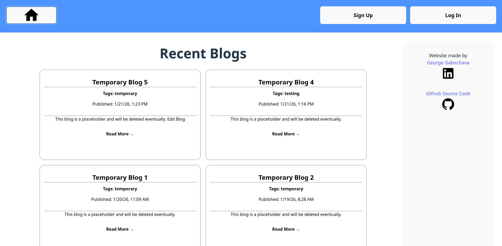

# Full‑Stack Blog API Platform

The application uses a single REST API backend with two separate front-ends. One frontend (bloggerFrontend) allows authorized bloggers to create posts using the TinyMCE editor and moderate comments. The second frontend (visitorFrontend) lets visitors to view published blog posts and allows registered users to submit comments.

The tech stack used includes PostgreSQL with Prisma ORM, Express, React/Vite, & Node.js. Passport‑JWT is used for JWT token‑based authentication. The backend also features server‑side validation, HTML sanitization, and CORS.

<h2>For installation:</h2>

A TinyMCE API key (free) is required for blogging in the bloggerFrontend project variables. TinyMCE premium features/plugins can be enabled (uncommented) in the Editor located in /bloggerFrontend/src/pages/BlogDetail.jsx (lines 268-293). Add your site to your TinyMCE approved domain list: https://www.tiny.cloud/my-account/domains/ .

Site Link: https://georgesblog.up.railway.app/

  

