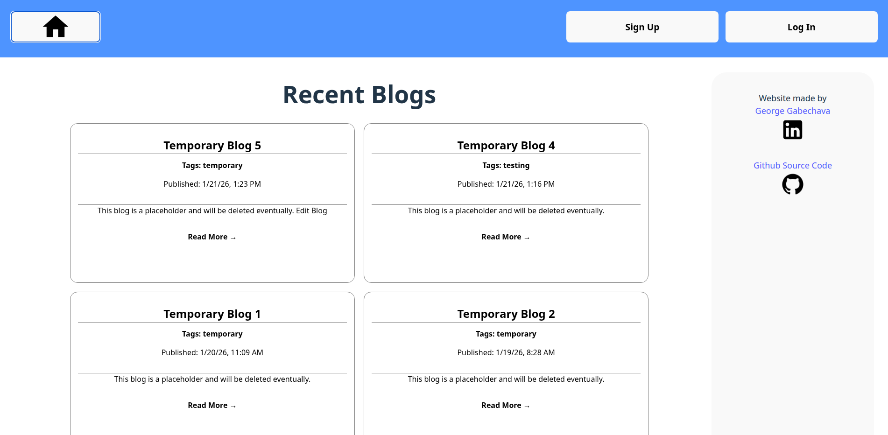

# Full‑Stack Blog API Platform

The application uses a single REST API back-end with two separate React front-ends.

Site Link: https://georgesblog.up.railway.app/

---

  

---

## Why I Built This

I find it important for everyone to have a place to express themselves, and a blog is a great place to start that. I also wanted to get experience with certain tools and a monorepo project structure. The seperation of front-ends for bloggers and viewers also allowed for clear seperation between features I wanted to add for each type of user. The first front-end, bloggerFrontend, allows authorized bloggers to work on posts (both published and unpublished) using the TinyMCE editor and moderate comments. The second front-end, visitorFrontend, lets visitors view published blog posts and allows registered users to submit comments.

Developing the project gave me hands-on experience with JSON Web Token (JWT) based authentication and authorization using RESTful APIs. The back-end gave me experience with cross-origin resource sharing (CORS) security features, setting up an external rich text editor, and JWT server‑side validation.

---

## Features

- **Blogger Front-end**: Authorized bloggers can create and edit posts using the TinyMCE rich text editor and moderate comments.
- **Visitor Front-end**: Visitors can browse published blog posts. Registered users can submit comments.
- **Back-end**: Single RESTful API for both front-ends. Passport-JWT for token-based authorization and authentication. CORS Support. Server-Side Validation & Sanitization.

---

## Tech Stack

| Layer            | Technology           |
| ---------------- | -------------------- |
| Database         | PostgreSQL           |
| ORM              | Prisma               |
| Backend          | Node.js + Express    |
| Frontend         | React + Vite (local) |
| Authentication   | Passport-JWT         |
| Rich Text Editor | TinyMCE              |

---

## For Setup

- [Node.js]
- [PostgreSQL] Running locally or via a provider. Ensure Prisma successfully migrates databases. (If running locally, Back-end .env file may need your "DATABASE_URL").
- [TinyMCE API key] Free via (https://www.tiny.cloud/). (If running locally, API may be needed in bloggerFrontend .env file.)

TinyMCE premium features/plugins can be enabled (uncommented) in the Editor located in /bloggerFrontend/src/pages/BlogDetail.jsx (lines 268-293). Add your site to your TinyMCE approved domain list: https://www.tiny.cloud/my-account/domains/
